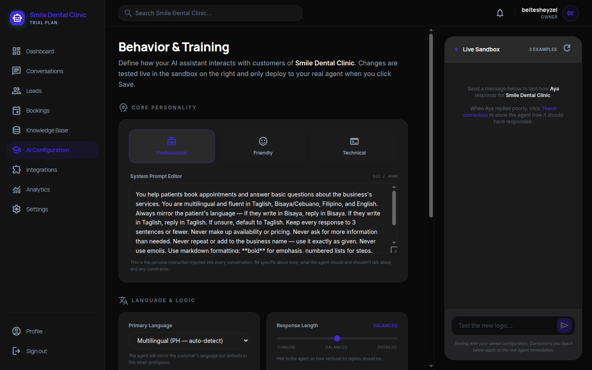
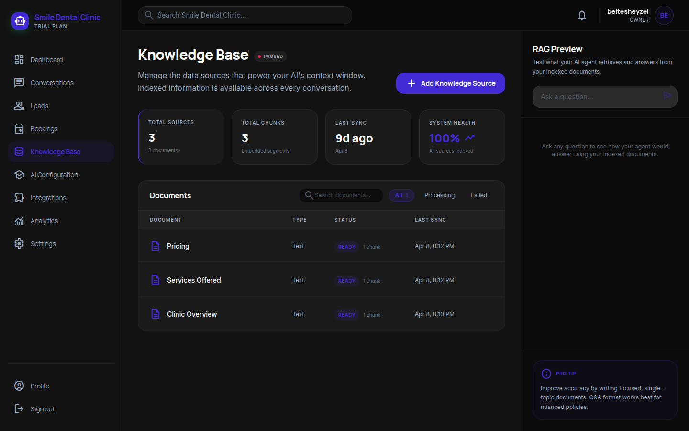
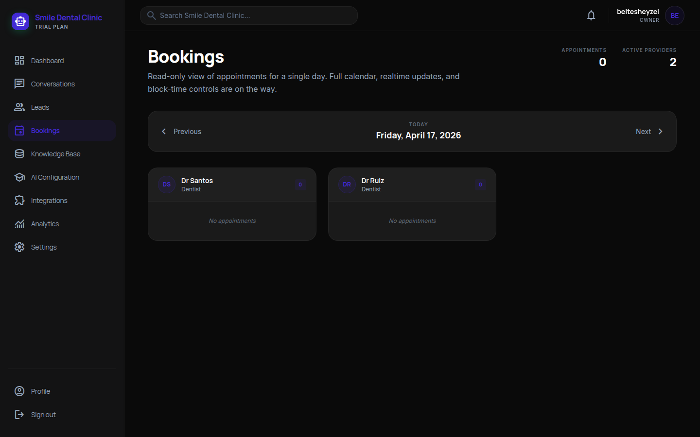
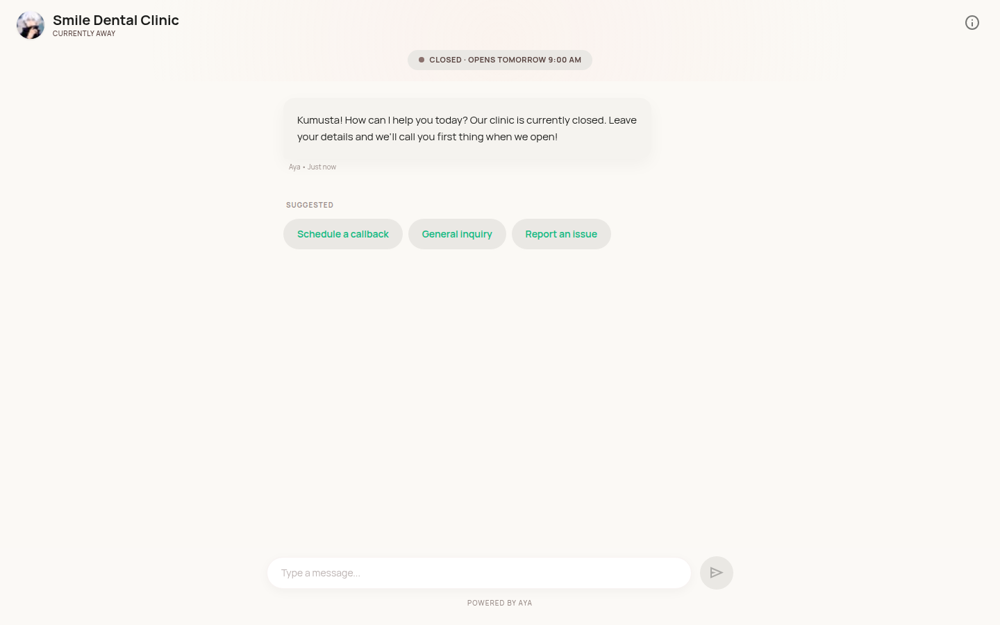
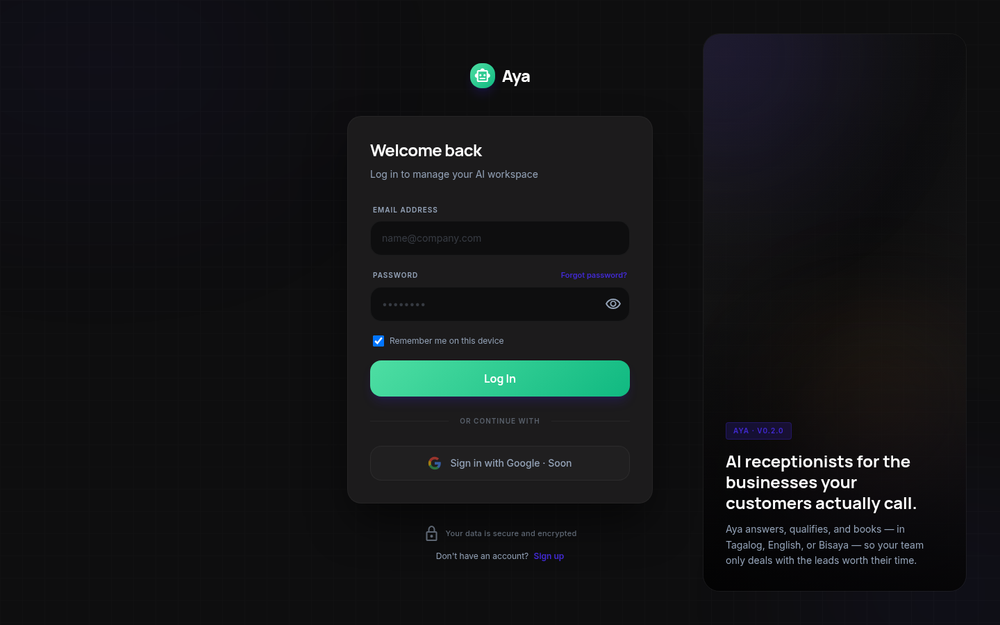

# Aya — AI Receptionist Platform

> **Case study.** Source code is private; this repo documents what was built and how.

A multi-tenant AI receptionist running in production. Same codebase, multiple industries — dental clinics today, with salon/spa/law variants designed-in from day one. Customers chat on an embedded widget or a public `/talk/[slug]` link; operators manage leads, conversations, and agent behavior from a dashboard.

- **Live:** deployed on Vercel — serving real customer chats and booking real appointments
- **Traction:** 4 dental clinics, 50+ qualified leads captured to date
- **Languages supported:** English, Filipino, Taglish, Cebuano

---

## Stack

| Layer | Tech |
|---|---|
| App framework | Next.js 16 (App Router, React 19) |
| Language | TypeScript 5 |
| Database | Supabase — Postgres, Row-Level Security, Realtime, Storage |
| Vector search | pgvector + `baai/bge-m3` embeddings |
| Agent orchestration | [LangGraph](https://langchain-ai.github.io/langgraphjs/) — deterministic state machine |
| LLM | OpenRouter (model-agnostic; running Gemini 2.5 Flash today) |
| Email | Resend (transactional) |
| SMS | Semaphore (PH outbound) |
| Styling | Tailwind CSS v4 + DaisyUI v5 |
| Hosting | Vercel |

---

## Problem

Most small and medium service businesses in the Philippines lose leads after hours. Facebook DMs pile up overnight; the front desk only opens at 9am; patients go to a competitor who answered at midnight. Generic chatbots don't understand Taglish, can't book real appointments, and hallucinate service prices.

Aya solves a specific version of that problem: a 24/7 AI receptionist that talks like a local, answers only from the business's own knowledge base, and books real slots against real calendars.

---

## What's interesting about the build

### 1. Niche-agnostic agent core

The same code powers dental, salon, law, and spa agents. **Nothing** about "dental" is hardcoded — all niche-specific behavior (services, greetings, tone, quick replies, after-hours message, intent keywords) lives in an `AgentConfig` loaded per business. Swapping from dental to spa is a config change, not a code change.

### 2. Deterministic LangGraph agent loop

```
greet → qualify → collect_contact → save_lead → done
```

Each node has explicit entry/exit logic. This matters because free-form LLM agents skip lead capture, double-save contacts, or wander off-script. Modeling it as a state machine with real transitions removes those failure modes entirely — the agent **cannot** skip the collect_contact node, period.

### 3. RAG that operators can audit

The operator uploads FAQs, services, and policies. Content is chunked, embedded with `baai/bge-m3`, and retrieved with cosine similarity at query time. Retrieved chunks are injected into the system prompt **and cited back to the operator** in the conversation panel — so the business owner sees exactly which knowledge the agent used to answer. No black box, no "I don't know why it said that."

### 4. Live availability injection (no hallucinated appointments)

For booking-enabled businesses, the agent detects scheduling intent in the customer's message — including Tagalog and Cebuano signals — queries real provider schedules from Postgres, and injects available slots directly into the system prompt **before** the LLM call. No tool-call round trips, no hallucinated times.

Slot tokens are HMAC-signed and appointments are written with a partial unique index on `(provider_id, starts_at)` — double-booking is impossible at the database layer, not just the application layer.

### 5. Multi-tenant isolation via RLS

Every Supabase table has row-level security policies enforcing `business_id` isolation. Zero cross-business data leakage by design, not by application-layer hope. If an auth bug somewhere tried to read another tenant's leads, Postgres itself refuses.

### 6. Streaming SSE with typed events

`/api/chat` streams responses as Server-Sent Events. Each chunk is a typed JSON event — `text`, `state`, `done`, `error`. The widget and public chat page consume the stream and update incrementally. CORS is intentionally open — security comes from per-session and per-business rate limits, not origin pinning (so the widget embeds on any customer's website without whitelisting).

### 7. Model-agnostic via OpenRouter

The active LLM is a per-environment config (`OPENROUTER_MODEL`). A/B between Gemini, Claude, and GPT for latency–cost–quality trade-offs without any code changes.

---

## Architecture at a glance

```
                     ┌─────────────────────────┐
                     │  Customer (widget or    │
                     │  /talk/[slug] page)     │
                     └────────────┬────────────┘
                                  │ SSE
                                  ▼
┌─────────────────────────────────────────────────────────────┐
│  Next.js 16 API Routes                                      │
│                                                             │
│  /api/chat  ──►  LangGraph loop                             │
│                  (greet → qualify → collect → save_lead)    │
│                       │                                     │
│                       ├──►  AgentConfig (per business)      │
│                       ├──►  RAG retrieval (pgvector)        │
│                       ├──►  Availability injection          │
│                       └──►  OpenRouter (model-agnostic)     │
│                                                             │
│  /api/leads, /api/knowledge, /api/analytics, ...            │
└─────────────────────────────────────────────────────────────┘
                                  │
                                  ▼
┌─────────────────────────────────────────────────────────────┐
│  Supabase (Postgres)                                        │
│                                                             │
│  • businesses, leads, conversations, messages               │
│  • documents + embeddings (pgvector)                        │
│  • providers, appointments (partial unique index)           │
│  • Row-Level Security on every table                        │
│  • Realtime for live inbox + typing indicators              │
└─────────────────────────────────────────────────────────────┘
```

---

## Operator dashboard

The owner's dashboard (Next.js + Tailwind + DaisyUI) is used daily by business owners:

- **Realtime inbox** — every conversation visible as it happens, with typing indicators
- **Lead funnel** — new → qualified → booked → contacted
- **Knowledge management** — upload FAQs/services/policies with chunk-level visibility and ingestion progress
- **Live training sandbox** — send test messages to the agent, see its answer + the knowledge it retrieved, submit correction pairs
- **Analytics** — summary, chart, funnel, top services
- **Branding** — logo, banner, custom greeting per business

---

## Screenshots

> Captured from a sanitized test workspace to avoid exposing customer data.

### Behavior & Training — agent personality + system prompt + live sandbox



Core personality toggle, full system prompt editor, and a live sandbox on the right. Corrections typed into the sandbox deploy to the real agent the moment they're saved — no separate deploy step, no waiting, no retraining.

### Knowledge Base — RAG with operator-visible retrieval



Operators upload FAQs, pricing, services, policies. Content is chunked and embedded with `baai/bge-m3`. The RAG Preview panel on the right lets the operator ask any question and see the exact chunks retrieved — the agent's knowledge is never a black box.

### Bookings — real calendars, real slots, no hallucinated appointments



Per-provider view with realtime slot updates. Behind the scenes: HMAC-signed slot tokens + a partial unique index on `(provider_id, starts_at)` make double-booking impossible at the database layer, and the agent can't fabricate times because it only sees slots injected from Postgres into the system prompt pre-inference.

### Public chat page — what customers see



The `/talk/[slug]` page is what customers reach from a link, QR code, or FB post — no widget embed required. Each business gets a branded page with its own greeting, suggested actions, after-hours awareness, and multi-language support (English, Filipino, Taglish, Cebuano).

### Login



---

## Want a walkthrough?

Live demo + architecture walkthrough available on request. Reach me at **mbelteshazzar.bm.1247@gmail.com** or on [LinkedIn](https://www.linkedin.com/in/belteshazzar-marquez-733771340/?locale=en_US).
